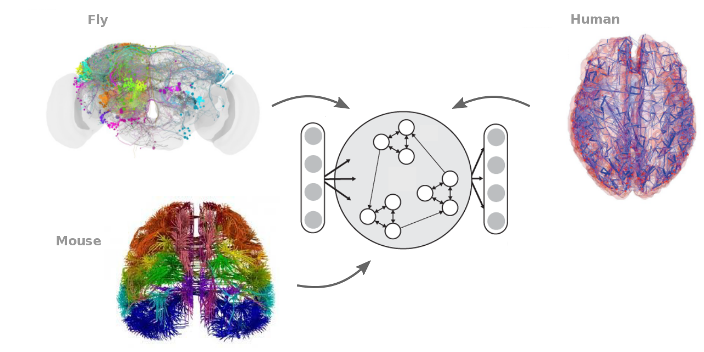

# Bio2Art
Convert biological neuronal networks to artificial neuronal networks by creating 
recurrent neuronal networks based on the topology dictated by empirical connectomes.



# Description

The Bio2Art offers an easy to use function to convert biological neuronal networks to artificial recurrent neuronal networks. To this end, empirical neuronal networks of diverse species are used. Currently, the neuronal networks of the following species can be used:
1. Macaque monkey (Macaca mulatta)
2. Marmoset monkey (Callithrix jacchus)
3. Mouse (Mus musculus)
4. Human (Homo sapiens)
5. Fly (Drosophila melanogaster)

Note that the term 'connectome' refers to a biological neuronal network.

Bio2Art builds artifical recurrent neuronal networks by using the topology dictated by the aforementioned empirical and by extrapolating from the empirical data to scale up the artifical neuronal networks. For instance, if the empirical data correspond to a neuronal network involving 29 brain regions, then the resulting artificial recurrent neuronal network can be scaled up by assuming a certain number of neurons populating each region (see examples below and documentation of the bio2art_import.py function). Thus, the output can be an artificial recurrent neuronal network with an arbitrary number of neurons (e.g., >>29 brain regions), but, importantly this networks obeys the topology of a desired biological neuronal network.   

The constructed artificial recurrent neuronal network is returned as a numpy array and, thus, can be used with virtually any type of artifical recurrent network, for instance, echo state networks.  

# Installation

Download or clone the repository and unpack it. Open a terminal and change to the corresponding folder. Type:

```
pip install .
```


# Examples

# Citations 
